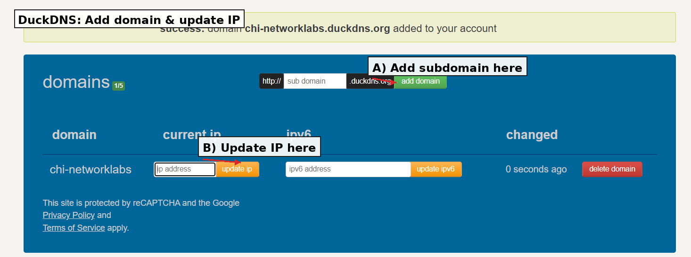

# Lab 01｜DNS

## 範圍說明
本文件涵蓋 Lab 01 的 DNS 基礎實驗，包含 DuckDNS 子網域註冊、A record 設定與 HTTP 存取驗證。

## 語言/版本
- 環境：Ubuntu on GCE
- 工具：`dig`（dnsutils）、`curl`

## 實驗 1.1：註冊 DuckDNS 子網域
### 目的
建立可用的網域名稱，作為後續解析與驗證使用。

### 前置需求
- DuckDNS 帳號

### 步驟
1. 登入 DuckDNS。
2. 新增一個子網域名稱，例如：`chi-networklabs.duckdns.org`（請替換成你自己的子網域）。



### 成功判斷
- DuckDNS 顯示子網域已建立。

## 實驗 1.2：設定 A record 指向伺服器
### 目的
將子網域解析到當下的 GCE 公網 IP。

### 前置需求
- GCE VM 具備公網 IP
- 可取得當下公網 IP

### 步驟
1. 取得 GCE VM 公網 IP（可在 GCE Console 查看，或在 VM 上查詢）：

```bash
curl -4 ifconfig.me
```

2. 在 DuckDNS 將子網域的 A record 指向該公網 IP。

### 成功判斷
- 使用 `dig` 或 `nslookup` 可查到 A record 指向預期 IP。

```bash
dig +short chi-networklabs.duckdns.org
```
請將 `chi-networklabs` 替換成你自己的子網域。

## 實驗 1.3：透過網域驗證 HTTP 存取
### 目的
確認網域可用於對外存取 HTTP 服務（80）。

### 前置需求
- GCE 防火牆允許 TCP 80
- VM 上有可用的 HTTP 服務（或可啟動簡易服務）

### 步驟
1. 在 VM 上啟動測試 HTTP 服務：

```bash
sudo python3 -m http.server 80
```

2. 從本機驗證：

```bash
curl -I http://chi-networklabs.duckdns.org
```
請將 `chi-networklabs` 替換成你自己的子網域。

### 成功判斷
- `curl` 回傳 HTTP 狀態碼（例如 200）。
- 範例回應：

```
HTTP/1.0 200 OK
Server: SimpleHTTP/0.6 Python/3.12.3
Date: Mon, 05 Jan 2026 02:37:28 GMT
Content-type: text/html; charset=utf-8
Content-Length: 361
```

### 注意
- 測試完成後請關閉服務（在執行視窗按 `Ctrl + C`）。
- 或改用限時啟動（例如 10 分鐘後自動關閉）：

```bash
sudo timeout 10m python3 -m http.server 80
```

## 失敗排查
- DNS 尚未生效：等待 TTL 或清除本機 DNS 快取。
- 解析到舊 IP：確認 DuckDNS 設定是否更新成功。
- 連線逾時：檢查 GCE 防火牆與 VM 的本機防火牆規則。
- 服務未啟動：確認 80 連接埠正在監聽。
